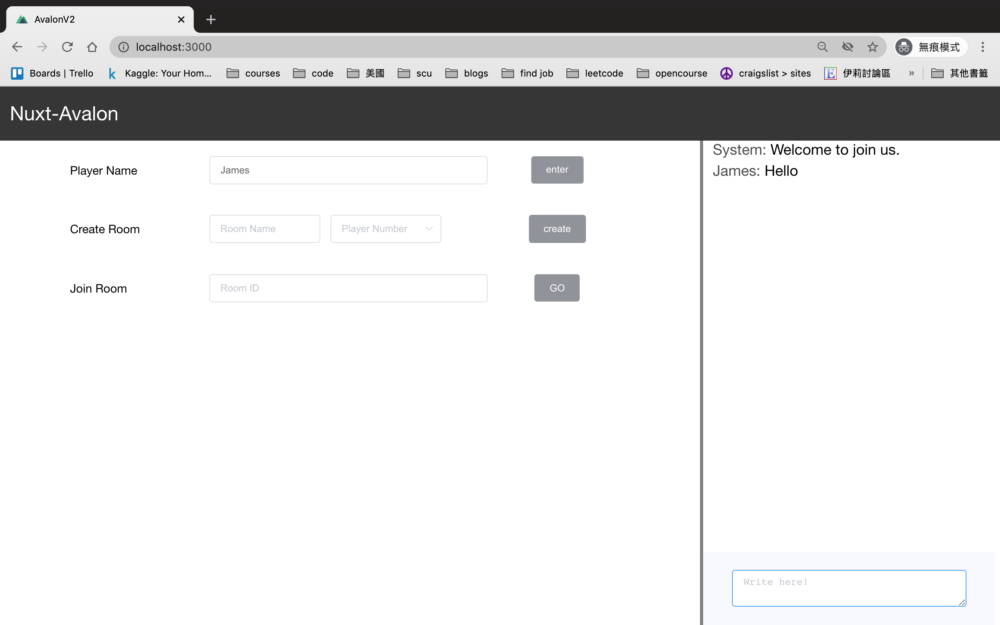
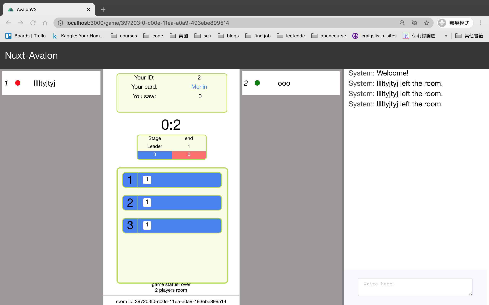

# Avalon client

> Online Board Game

## Build Setup

``` bash
# install dependencies
$ yarn install

# serve with hot reload at localhost:3000
$ yarn run dev

# build for production and launch server
$ yarn run build
$ yarn start

# generate static project
$ yarn run generate
```

For detailed explanation on how things work, checkout [Nuxt.js docs](https://nuxtjs.org).

## pages

hall: Home page for users to input their username, create game room and joing game by room id.



game room: The page for playing avalon game. The game will start as long as there are enough players in the room.



## action commands in game

    // vote Y or N - Vote for deciding whether mission is proceeding or not.
    // quest player id - Quest a player to join the mission.
    // unquest player id - Remove a player from the mission.
    // action S or F - Make mission success or fail
    // assassinate player id - Assassinate the player whom you think is Merlin.
